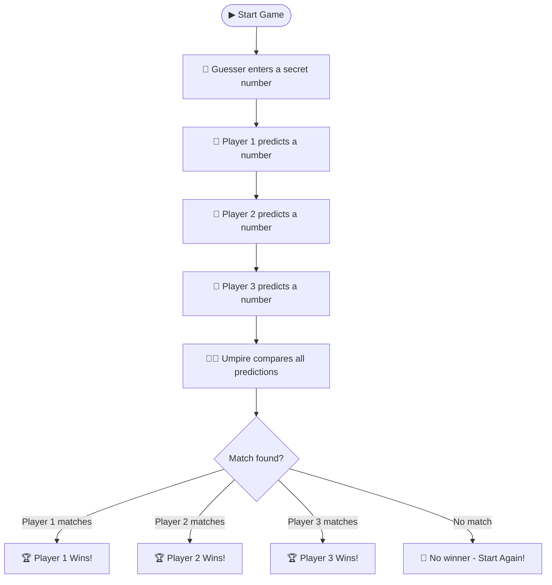

<div align="center">


# Number Guessing Game

### A Multi-Player Console Game built with Java


> A fun Java console game where a **Guesser** hides a number and **3 Players** try to predict it. An **Umpire** collects all inputs and declares the winner!

</div>

---

## 📌 Table of Contents

- [How the Game Works](#-how-the-game-works)
- [Features](#-features)
- [Demo](#-demo)
- [Class Design](#-class-design)
- [Project Structure](#-project-structure)
- [Getting Started](#-getting-started)
- [Concepts Used](#-concepts-used)
- [Future Improvements](#-future-improvements)
- [Author](#-author)

---

## 🎮 How the Game Works



---

## ✨ Features

| Feature | Description |
|---|---|
| 🧑 **Guesser Role** | One player secretly picks a number |
| 👥 **3 Players** | Three players each submit their prediction |
| ⚖️ **Umpire System** | Umpire collects and compares all numbers fairly |
| 🏆 **Winner Detection** | Instantly announces which player guessed correctly |
| 🔄 **Replay Prompt** | Tells players to start again if nobody wins |

---

## 🎬 Demo

```
╔══════════════════════════════════════╗
║     🎲  NUMBER GUESSING GAME        ║
╚══════════════════════════════════════╝

GUESSER, kindly enter your number
> 42

PLAYER 1 kindly enter your number
> 15

PLAYER 2 kindly enter your number
> 42

PLAYER 3 kindly enter your number
> 78

🏆 player 2 is winner!
```

---

## 📝 Class Design

```
┌──────────────────┐   ┌────────────────┐
│   Guesser       │   │    Player      │
├──────────────────┤   ├────────────────┤
│ + gNum: int    │   │ + pNum: int   │
│ + guessingnum()│   │ + predictingnum│
└──────────────────┘   └────────────────┘
         │                    │
         └──────┬─────────┘
                ▼
   ┌────────────────────────┐
   │         Umpire           │
   ├────────────────────────┤
   │ + numFromGuesser: int    │
   │ + numFromPlayer1/2/3:int │
   │ + collectingNumFromGuesser()│
   │ + collectingNumFromPlayer() │
   │ + comparing()            │
   └────────────────────────┘
                ▼
   ┌────────────────────────┐
   │       guessergame        │
   │     (main class)         │
   └────────────────────────┘
```

### Class Breakdown

| Class | Role | Key Method |
|---|---|---|
| `Guesser` | Holds the secret number | `guessingnum()` — prompts & returns guesser's number |
| `Player` | Represents each player | `predictingnum(int)` — prompts player by number & returns prediction |
| `Umpire` | Manages the whole game | `collectingNumFromGuesser()`, `collectingNumFromPlayer()`, `comparing()` |
| `guessergame` | Entry point | `main()` — creates Umpire, calls all 3 methods in order |

---

## 📁 Project Structure

```
📦 guessing-game/
├── 📄 guessergame.java     ← All 4 classes in one file
└── 📄 readme.md            ← Project documentation
```

---

## 🚀 Getting Started

### Prerequisites

- ✅ Java JDK **8 or above**
- ✅ `javac` and `java` in your system PATH

### Run the Game

```bash
# 1. Clone the repository
git clone https://github.com/Uttkarshchambiyal/java-Small-Projects-.git

# 2. Navigate to the guessing-game folder
cd java-Small-Projects-/guessing-game

# 3. Compile
javac guessergame.java

# 4. Run
java guessergame
```

---

## 🧠 Concepts Used

```
✔ Object-Oriented Programming (OOP)
✔ Multiple Classes in a single file
✔ Objects and Instance Variables
✔ Methods with parameters and return values
✔ Console I/O using Scanner
✔ Conditional Statements (if-else chain)
✔ Delegation pattern (Umpire delegates to Guesser & Player)
```

---

## 🔮 Future Improvements

- [ ] 🔢 Set a valid number range (e.g., 1–100)
- [ ] 🔄 Add a game loop so players can replay without restarting
- [ ] 👥 Support dynamic number of players
- [ ] ⚠️ Add input validation for non-numeric entries
- [ ] 📊 Track scores across multiple rounds
- [ ] 🌟 Add difficulty levels (Easy / Medium / Hard range)

---

## 👨‍💻 Author

<div align="center">

**Uttkarsh Chambiyal**

[](https://github.com/Uttkarshchambiyal)

*"Building one mini project at a time 🚀"*

</div>

---

<div align="center">

⭐ **If you found this helpful, give it a star!** ⭐

</div>
